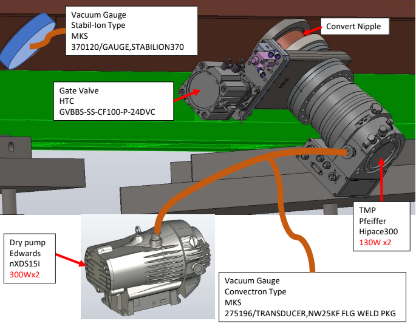
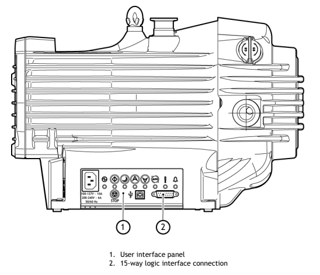
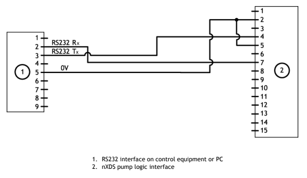
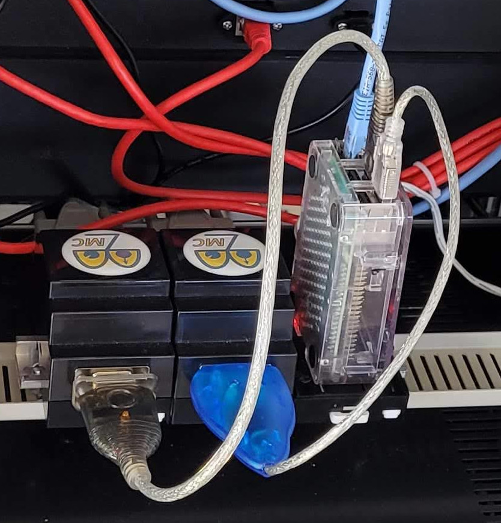
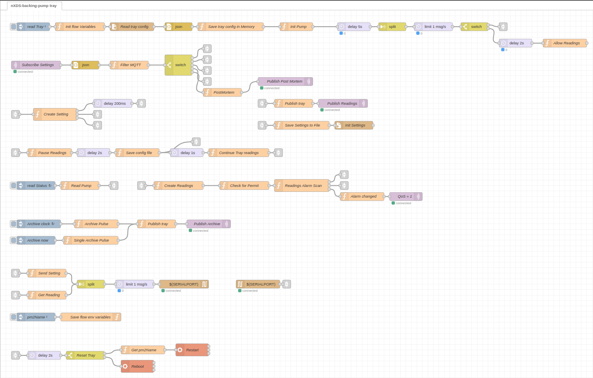

# Backing Pump System
* <a href="https://github.com/bl-mirrotron/nXDS-backing-pump-tray" target="_blank">Source code</a>
* [Vacuum system overview](https://bl-mirrotron.github.io/#vacuum-system)
* [Control system overview](https://bl-mirrotron.github.io/)

The exhaust of each turbo pump is pumped with an <a href="https://shop.edwardsvacuum.com/products/a73701983/view.aspx" target="_blank">Edwards nXDS15i</a> dry pump used as a backing pump as shown in Figure 1. The backing pump has a 15 pin logic connection as shown in Figure 2. The logic interface can be configured to communicate with a RS232 connection as shown in Figure 3. This RS232 interface can then be transformed into a USB interface with a <a href="https://www.electrokit.com/en/product/usb-rs232-converter-for-pc/" target="_blank">USB-RS232 converter</a> and then connected to a Raspberry Pi computer as shown in Figure 4.

The tray code is written in the <a href="https://nodered.org/" target="_blank">Node-RED</a> programming environment. The tray code uses a modified Blinky-Lite template for ASCII serial communication using Blinky-Bus as shown in Figure 5.

Figure 1.  RFQ Vacuum system layout

 

Figure 2.  Edwards nXDS15i dry pump

 

Figure 3.  RS232 connection to backing pump logic interface

 

Figure 4.  USB-RS232 converter to a Raspberry Pi 3B

 

Figure 5.  Backing pump tray flow

 
